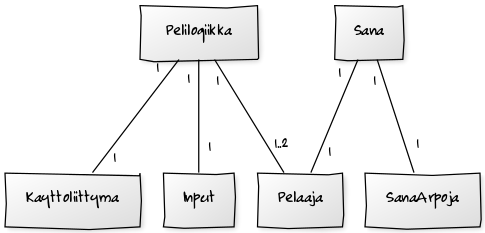

**Aihe:** hirsipuu-peli joka toivottavasti saadaan mukautettua toista pelaajaa vastaan pelattavaksi kaksinpeliksi tms. mielenkiintoinen twist.

**Hirsipuu kaksinpelinä**: Voisi toimia esim. Tetriksen tapaan, missä pelaajat kilpailevat siitä, kumpi saa ratkottua tietyssä ajassa enemmän sanoja. Liekö verkon yli pelattava moninpeli liian iso pala purtavaksi tälle kurssille?

**Käyttäjät:** Pelaaja. 

**Toimintoja:** 
- Menun navigoiminen (kenties pelin sääntöihin liittyviä asetuksia tai AI:n vaikeustason säätelyä).
- Pelaaminen

