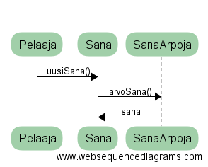

**Aihe:** Hirsipuu peli perustoiminnoilla. Ohjelma kykenee lukemaan sanalistan tiedostosta ja arpoa sanan pelaajan arvattavaksi. Pelaajalle on graafinen käyttöliittymä, joka kuvaa pelin tilannetta.

**Hirsipuu kaksinpelinä**: Voisi toimia esim. Tetriksen tapaan, missä pelaajat kilpailevat siitä, kumpi saa ratkottua tietyssä ajassa enemmän sanoja.

**Käyttäjät:** Pelaaja. 

**Toimintoja:** 
- Menun navigoiminen (kenties pelin sääntöihin liittyviä asetuksia tai AI:n vaikeustason säätelyä).
- Pelaaminen

**Rakennekuvaus**
Yksinkertaisuutensa vuoksi ohjelma on helposti ymmärrettävä. Pelaaja luokka pitää kirjaa pelaajan tilasta ja osittain myös sanan tilasta (tämä siksi että mikäli aika riittää ohjelmaan lisätään vielä moninpeli jossa molemmilla pelaajilla on oma sana). Pelilogiikka luokka käynnistää pelin ja luo käyttöliittymän. SanaArpoja lukee sanat.txt tiedostosta sanat ja arpoo niistä tarpeen tullen yhden arvattavaksi. Pelitilaa päivitetään aina kun pelaaja arvaa sanan.

**Käyttöohjeet**
Suorita ohjelma, kirjoita tekstilaatikkoon arvattava kirjain ja paina Arvaa. Samaa kirjainta voi arvata vain kerran. Voit myös arvata koko sanan kirjoittamalla sen tekstilaatikkoon. Peli loppuu, kun arvaat koko sanan tai arvaat väärin 7 kertaa.

